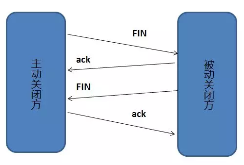
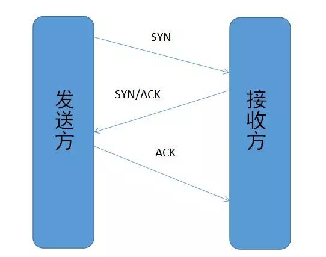

# 工作计划

### 预复习知识点：

#### 语言类：

##### 通用：

闭包和类的区别

>定义：
>
>闭包本质上是个函数，如果存在嵌套的函数，且子函数引用了父函数的变量，该子函数和引用的父函数的变量即会形成闭包。
>
>python中闭包实现机制：
>
>所有函数都存在一个`__closure__`属性如果该函数为闭包，返回一个元组对象，其中的call_content 属性即为闭包中的自由变量
>
>闭包优点：
>
>闭包包含了函数和其作用域外的局部变量
>
>闭包避免了使用全局变量
>
>使用范围：
>
>装饰器
>
>python的迭代中没有作用域概念，可以使用闭包来保持迭代中迭代变量的值。

尾递归优化

> 递归缺点：展开时需要大量中间缓存占用栈空间（因为要保存函数的入口环境）
>
> 尾递归：只在函数的尾部返回自身调用，可以不保存入口环境得到正确值。
>
> 尾递归优化：转化为循环
>
> 。。。。。感觉没啥用，应该是给函数式编程用的

高阶函数

> 1.接受函数作为参数的函数 E.G.: filter()
>
> 2.返回一个函数的函数 E.G.: 懒加载

##### Python

lambda表达式

> 格式：`lambda [arg1][,arg2, arg3.....] :expression `
>
> 表达式只能由一行 不能使用if for print
>
> 目的：减少单行函数，使代码更简洁 
>
> 返回一个函数对象，这个对象没有名称，但可以将lambda表达式赋给一个变量来调用
>

生成器（Generator）

> 懒加载机制，节省内存空间
>
> 列表生成式：[使用x的表达式 for x in 可迭代对象]
>
> 生成器：(使用x的表达式 for x in 可迭代对象)
>
> 生成器存在next()方法，调用时计算下一个返回值，同时生成器也为可迭代对象，可通过迭代获取所有值
>
> yield关键字的作用：使用yield的函数被解释器视为生成器，遇到yield关键字时返回yield右值并记录位置，下次调用next方法时从yield的下一行开始执行。

@property

>表现为将被装饰的方法变为可直接访问和修改的属性。具体使用时可以用它来实现类似于私有属性的效果。

装饰器（Decarator）：

> 将被装饰的函数作为传入值，传给装饰器函数，进行包装之后返回新的函数。E.G. ：为一个函数添加传入值检查

偏函数

>与装饰器类似，同样是一种语法糖，可以固定函数中的某些参数的值，即设定一个默认值

static method 和 class method

> static method表示这个函数不需要用到类（cls）和实例（self）作为传入值与外部的函数效果相同
>
> class method 表示该函数只用到了类（cls）作为传入值，与实例无关，与C++中的静态方法相同

元类

> python 中类也是一个对象，元类就是类（对象）的模板

异常处理（try except finally ）

>except用来捕获所有的异常 Python中的所有错误都会抛出一个异常

Python是如何进行内存管理的？

>

Python的布尔判断

> 在Python中，None、任何数值类型中的0、空字符串 “”、空元组 ()、空列表 []、空字典{}都被当作False，自定义类型，如果实现了 　__ nonzero __ ()　或　__ len __ () 方法且方法返回 0 或False，则其实例也被当作False，其他对象均为True。

Python的三元运算

> bool and x or y  体现了Python中的短路语法 如果 bool表达式为假则短路x返回y 如果为真则短路y
>
> ​                             有坑->如果x为空串等False类对象，则会返回y
>
> x if bool else y 推荐方式

GIL的理解

>

##### Java

重载与重写

>

final关键字 

>
垃圾回收
### JAVA垃圾回收机制

​	由于有垃圾回收机制，对象不存在“作用域”的概念，只有对象的引用，才有“作用域”的概念。垃圾回收可以有效的防止内存泄漏，有效的使用空闲的内存。

​	内存泄漏：内存空间使用后未释放，在java中表现为一个内存对象的生命周期超过了程序需要使用的时间。

​	垃圾回收的算法做的事情：①寻找无用的信息块②回收这些对象所占用的空间。

​	垃圾回收算法：

1. 引用计数法，即一个对象，有别的对象引用它时，它的计数就加1。当它的计数器为0时，就可以当作垃圾被回收。

   对象A引用对象B，对象B引用对象C。没有对象引用A，A被回收时，B的计数就减一。

   优点是迅速，高效。

   缺点是无法解决循环引用的问题，如果一个父对象对子对象有个引用，子对象反过来也引用父对象，那么它们的计数永远不可能为0。

   一个示例：

   ~~~java
   ```public class Main {
       public static void main(String[] args) {
           MyObject object1 = new MyObject();
           MyObject object2 = new MyObject();
             
           object1.object = object2;
           object2.object = object1;
             
           object1 = null;
           object2 = null;
       }
   }
   ~~~

2. tracing算法(Tracing Collector) 或 标记-清除算法(mark and sweep)

   根搜索算法：

   ​	把引用关系看成一张图（树状图），从根节点GC root开始找起，寻找对应的引用节点。当所有引用关系找完之后，剩余的节点就被看成是没有被引用的节点，就是无用节点。

   java中可被看成GC ROOT节点的对象：

   java中可作为GC Root的对象有

   1. 虚拟机栈中引用的对象（本地变量表）

   2. 方法区中静态属性引用的对象

   3. 方法区中常量引用的对象

   4. 本地方法栈中引用的对象（Native对象）

   标记-清除算法：

   ​	图解很清晰：

   

   ​	标记-清除算法不需要对对象进行移动，所以很高效，但同时也会带来碎片空间的问题。

3. 标记-整理法。

   ​	为了解决标记-清除法带来的碎片空间的问题，即在标记-清除法的基础上进行对象的移动。优点是解决了碎片空间的问题，缺点是带来了效率低的问题，成本高，还要添加句柄和句柄表。

4. copying算法

   ​	标记-整理法需要句柄和句柄表，为了解决句柄带来的开销，一个新的方式是，把堆分为一个对象面和多个空闲面，当对象面满了，基于coping算法，从对象面中找出活动对象，并将每个活动对象复制到空闲面，完了之后呢，被复制的空闲面就成了对象面，原来的对象面也就成了空闲面。

   ​	在执行这个复制的动作时，程序要暂停执行。


​	

5. generation算法

   分代垃圾回收机制

   ​	经历了多次回收依然留下来的。。。就叫老一代，这样就把新生代和老一代分开。。。。分开回收。。。各自采用各自合适的回收算法。。。然后还有个持久代，就是用来存放静态文件，如JAVA类、方法等。持久代对垃圾回收影响不是很大。

   


### GC 垃圾回收

​	Scavenge GC ：这种是当新对象生成，如何Eden Space又申请失败，就会把Eden Space里的活对象移到Survivor 里面去，然后再整理Survivor 的两个区。大部分对象生成时都是从Eden Space申请空间，Eden Space又不会很大，所以Eden Space的GC会频繁执行。就要选择效率很高的算法能尽快把Eden Space空闲出来。

​	Full GC：这个是要对整个堆做处理的，上图三行都是要处理的堆，所以要尽可能减少调用Full GC的次数。第二行和第三行（年老代、持久代）被写满时；System.gc()被显示调用；上一次GC之后Heap的各域分配策略动态变化，都会触发Full GC。

### <u>JAVA有了GC同样会引起内存泄漏。</u>

### <u>好像记得有句话是这么说的，JAVA GC垃圾回收机制 是尽最大努力去回收。</u>

##### C++

虚函数实现机制

>

菱形继承出现的问题及解决方法

> 最终的子类中会存在两份祖类的代码，具有二义性，并且数据冗余
>
> 消除二义性：直接指定访问对象
>
> 消除数据冗余：使用虚函数

内存管理

>

多态的实现和理解

>

#### 网络类：

TCP UDP区别

>UDP：
>
>1.不保证传输可靠性
>
>2.以数据报文段形式通信（应用程序下发的报文直接添加首部之后直接移交IP层不打包或拆分）
>
>3.吞吐量与数据生成速率和网络速率有关，没有拥塞控制算法。
>
>4.可以一对一，也可以一对多，多对多。
>
>TCP：
>
>1.面向连接，尽量保证可靠性
>
>2.只能一对一，点对点
>
>3.面向字节流，会进行分包或打包
>
>4.速率会受到拥塞控制算法的影响
>
>

TCP三次握手四次挥手

>三次握手：
>
>
>
>
>
>为什么要三次握手：
>
>最低需要3次通信才能互相确认自己和对方之间的双向连接正常
>
>第一次握手 接收方确认对方发送正常 
>
>​                   发送方通知接收方自己的 SEQ=x
>
>第二次握手 发送方确认自己接收发送正常，对方接收发送正常 接收方只能确认自己接受正常，对方发送正常
>
>​                   接收方通知发送方自己的 SEQ = y 并且回复 ACK = x+1
>
>第三次握手 双方确认双方接收发送都正常
>
>​                   发送方回复接收方ACK = y+1
>
>四次挥手：
>
>
>
>为什么要四次挥手
>
>任何一方都只能主动关闭自己的发送连接，但不能关闭接收对方发送的连接，防止数据丢失。

TCP 包为什么需要 SEQ

> seq编码是ack机制的组成部分
>
> seq用来标记数据包，并且用来和ACK回执搭配确认数据包是否正确抵达
>
> 如果到达设定时间没有收到对应的ack就重发包，
>
> 如果接收到的seq和之前的顺序不符，则丢弃包，重发上一份ack

TCP为什么可靠

> 1.校验和机制（每次接收到包之后都会进行计算，不正确就丢弃包）
>
> 2.定时器（分组丢失重传）
>
> 3.ack机制（sqe编号）
>
> 4.滑动窗口和流水线机制
>
> 5.连接的建立和断开机制

TCP拥塞控制

HTTP长连接

HTTP基础知识（GET POST区别 header中各个字段的作用 ）

HTTPS（SSL）相关理解

在浏览器中输入URL到显示出页面的过程

cookie和session的实现

对RESTful的理解

> 使用URI

OSI七层模型

>
>
> 
>
> 每层对上层透明

#### 系统类：

死锁原理和避免死锁

>

Linux文件系统

>

进程管理

>

线程相关

>

同步异步

>

进程间通信

>

线程的通信

>同进程：
>
>异进程：

内核态 用户态区别

> 内核态存放操作系统内核等核心代码，具有严格的访问控制和更高的权限

中断原理

>

多路复用（epoll,select的区别、边缘触发,水平触发区别，实现方法）

>

理解多线程和多进程的区别和优缺点

>

分布式相关

#### 数据库类：

SQL和NoSQL的区别

>

MySQL两种数据引擎区别

> MyISAM
>
> 1.不支持事务
>
> 2.读性能高
>
> 3.索引数据分开存储，索引有压缩
>
> 4.支持全文搜索
>
> 5.保存表的具体行数,不带where时，直接返回保存的行数
>
> 6.DELETE 表时，先drop表，然后重建表
>
> 7.恢复快
>
> InnoDB
>
> 1.支持事务
>
> 2.支持外键
>
> 3.支持行级锁
>
> 4.不保存表的具体行数
>
> 5.DELETE时不重建表而是逐行删除
>
> 6.不支持FULLTEXT类型的索引
>
> 7.跨平台可直接拷贝使用
>
>

索引理解与实现

> 索引的优点：1. 天生排序。2. 快速查找。
> 索引的缺点：1. 占用空间。2. 降低更新表的速度。
>
> 分六种索引：
>
> 普通索引，唯一索引，主键索引，复合索引，外键索引，全文索引
>
>

数据库事务的理解

>

分页的实现

>

ACID的理解

>

#### 算法与数据结构类：

##### 算法

时间复杂度

空间复杂度

排序（快速排序 冒泡排序 选择排序 插入排序 堆排序）

查找（二叉排序树 平衡二叉树 B+树 红黑树）

深度优先遍历 广度优先遍历

缓存置换算法

LRU

Hash算法

##### 数据结构

栈和队列的实现和理解

线性表的实现和理解

二叉树

#### 安全类：

XSS的理解

csrf理解

sql注入

#### 其他类：

Nginx反向代理

Docker相关知识（分层镜像，隔离，虚拟化， 容器）

文字编码

### 预学习知识点：

##### Java

垃圾回收

类加载

泛型

AOP

反射

单例模式

##### 数据库

cache的理解


